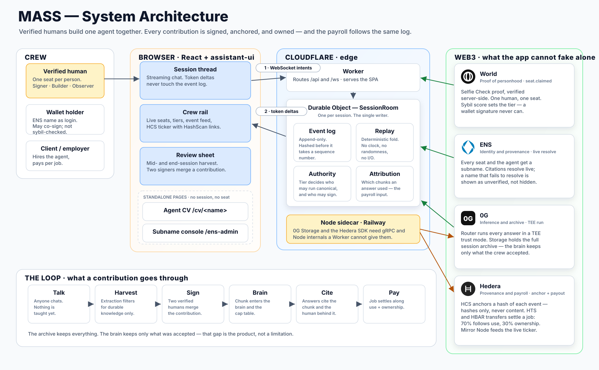

# Architecture

<p align="center">
  
</p>

The diagram is generated, not drawn. Regenerate it after changing the system:

```bash
python3 scripts/gen-architecture-diagram.py
```

---

## The shape of it

A MASS session is one **Durable Object**. That single decision explains most of
the rest.

Several people talk to the same agent at the same time, and everything the
product claims afterwards — who taught what, who owns what, who gets paid —
rests on the order those events happened in. A conventional stateless backend
would need a lock or a consensus round to agree that order. A Durable Object is
a single writer by construction: one object per session, one place events are
appended, no second opinion about sequence.

Everything else is arranged around that.

| Layer | What runs there | Why there |
|---|---|---|
| Browser | React + assistant-ui: the thread, the crew rail, the review sheet, the agent CV, the subname console | Streaming chat needs to feel local; the wallet lives here and cannot move |
| Cloudflare Worker | routes `/api` and `/ws`, serves the SPA | Edge-cheap, and it is the front door to the DO |
| Durable Object `SessionRoom` | the event log, replay, authority, attribution, inference orchestration | Single writer. See [`src/session-do.ts`](../../src/session-do.ts) |
| Node sidecar (Railway) | 0G Storage uploads, Hedera SDK writes | Both need gRPC and Node internals a Worker does not have |
| Chains | World, ENS, 0G, Hedera | The four things the app must not be trusted to assert about itself |

---

## The three-layer protocol

Mixing these up is the most common way to corrupt a session, so they are named
separately throughout the code:

- **Intent** — client to server. A request. Carries no authority: the server
  decides whether the seat may do it.
- **Event** — durable, ordered, replayable. The only thing that changes state.
- **Delta** — ephemeral wire traffic. Token-by-token output. Never persisted.

A streaming answer produces hundreds of deltas and exactly two events. If deltas
reached the log, replay would drown and the log would stop being an audit trail.

Full protocol: [`spec/shared-session-spec.md` §3](../spec/shared-session-spec.md).

---

## Replay, and why `apply()` is boring on purpose

State is a fold over the event log. The fold must be deterministic — no
`Date.now()`, no randomness, no I/O — because the same log has to produce the
same state on every machine, forever. Anything non-deterministic has to happen
*before* the event is written, and its result stored in the payload.

This is also why the DO hashes a payload **before** claiming a sequence number:
a DO yields at every `await`, so a hash computed after taking `seq` can
interleave with another write and anchor the wrong pair.

---

## Where each chain actually sits

The test for every integration below: **remove it, and does something the
product claims stop being true?**

### World — proof of personhood

A Selfie Check proof, verified server-side, is what turns a visitor into a seat.
The sybil score sets the tier; below the threshold a real proof still only earns
Observer. Wallet sign-in exists as an alternative, and is deliberately weaker —
a signature proves key control, never uniqueness, so those seats cap at Builder
and are labelled as such. Without World, one person can hold every seat and the
cap table means nothing.

### ENS — identity and provenance

Every seat and the agent itself get a subname. Citations are **resolved live**:
the tooltip's tier, uniqueness band, and contribution count come from ENS text
records, not from a string we stored next to the chunk. A name that fails to
resolve is shown as unverified rather than hidden, because the honest failure is
the point. Hiring goes through resolution too.

Note that on ENS v2 a name has no children until it owns a registry — hence
[`/ens-admin`](../../web/src/EnsAdmin.tsx) and [`src/ens/v2.ts`](../../src/ens/v2.ts).

### 0G — inference and archive

Every answer runs through the 0G Router in a TEE trust mode. The full session is
archived to 0G Storage, while the brain keeps only what the crew accepted — that
gap between archive and brain is the product, not a shortcoming.

Storage runs in the sidecar: the SDK is built on axios 0.27, which picks its
adapter at import time and finds none in a Worker.

### Hedera — provenance and payroll

HCS anchors a **hash** of each event; content never leaves our infrastructure.
Mirror Node reads feed the live ticker and the HashScan links. A settled job
splits 70% along measured use and 30% along the cap table, in integer tinybars,
reconciling exactly — see [`src/hedera/split.ts`](../../src/hedera/split.ts).

The Hedera SDK needs gRPC, which is the other half of why the sidecar exists.

---

## The loop a contribution goes through

1. **Talk.** Anyone chats. Nothing has been taught yet — ordinary conversation
   does not reach the brain.
2. **Harvest.** Mid- or end-session, extraction proposes candidates. It is tuned
   for precision: it filters, and misses things on purpose.
3. **Sign.** Two distinct verified humans merge it. The author may be one.
4. **Brain.** The chunk enters the brain and the cap table together.
5. **Cite.** Later answers cite the chunk and the human behind it.
6. **Pay.** A job settles along use and ownership.

---

## Known seams

- The sidecar is a second deployment target, so a Railway outage costs archive
  writes and Hedera writes while the session itself keeps running.
- Wallet seats are weaker than World seats by design; the UI says so rather than
  averaging the two into one misleading badge.
- ENS subname issuance still needs an owner-signed transaction; automating it
  means granting the app's key the registrar role on the parent's registry.
